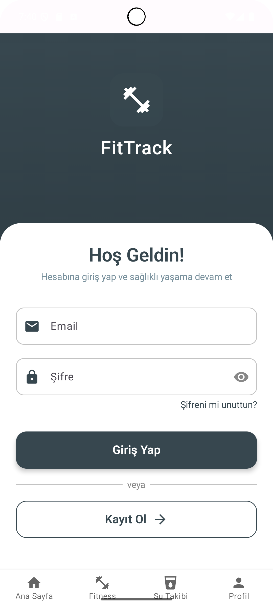
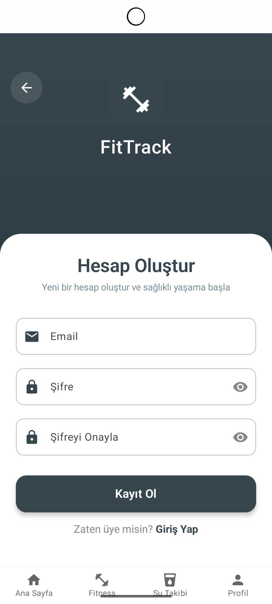
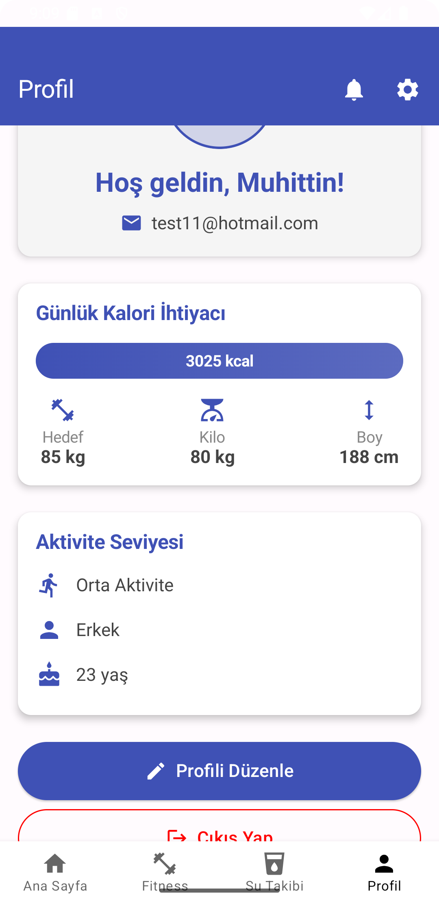
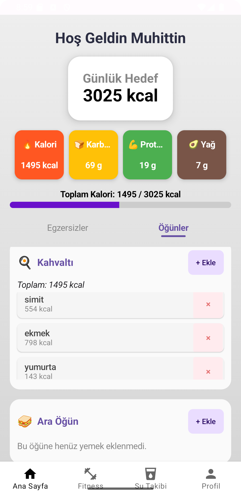
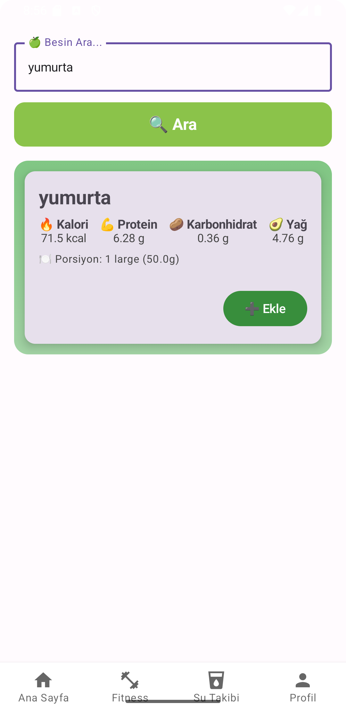
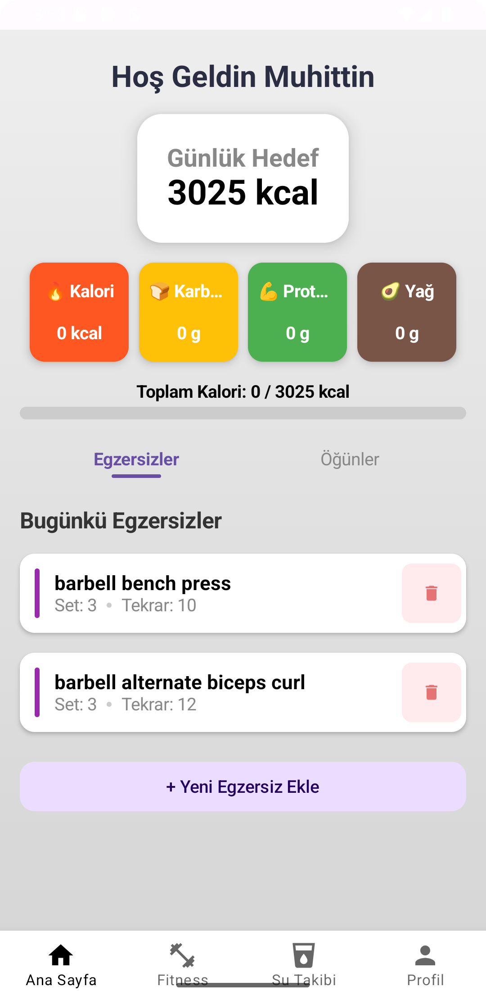
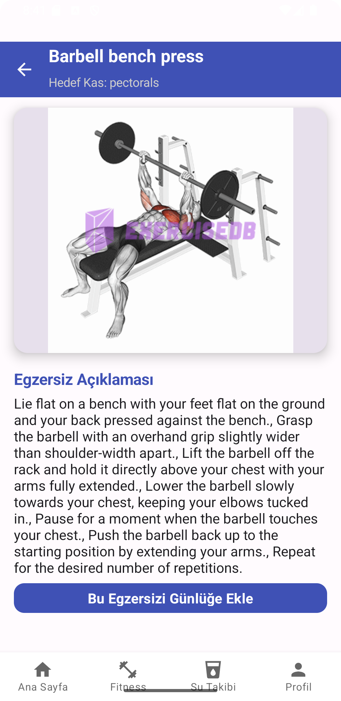
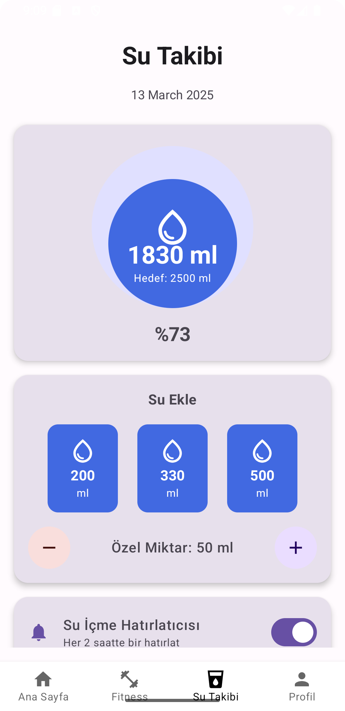

# 🏋️‍♂️ Fitness Calorie Tracking App

Fitness Calorie Tracking App, kullanıcıların günlük kalori alımını ve egzersizlerini takip etmelerine yardımcı olan bir Android uygulamasıdır. Jetpack Compose, Firebase Firestore, Retrofit, Nutritionix API ve ExerciseDB API ile geliştirilmiştir.

---

## 📸 Ekran Görüntüleri

### 🔹 Giriş & Profil  
  
  
  

### 🔹 Kullanıcı Bilgileri Adımları (GIF)  
  

### 🔹 Ana Sayfa & Kalori Takibi  
  
  

### 🔹 Egzersiz & Su Tüketimi  
  
  
  


## 🚀 Özellikler

✔️ Kullanıcı Kaydı & Girişi – Firebase Authentication ile güvenli giriş  
✔️ Günlük Kalori Takibi – Kullanıcının öğünlerine göre günlük kalori hesabı  
✔️ Egzersiz Takibi – Yapılan egzersizlerin kaydedilmesi ve görüntülenmesi  
✔️ Öğün Ekleme – Nutritionix API’den yemek verisi çekerek öğün ekleme  
✔️ Firebase Firestore – Kullanıcı verilerinin saklanması  
✔️ Modern UI – Jetpack Compose ile modern ve akıcı tasarım   

---

## 🔧 Kullanılan Teknolojiler

- **🛠️ Jetpack Compose** – Modern UI tasarımı
- **🔥 Firebase Authentication & Firestore** – Kullanıcı yönetimi & veri saklama
- **🌍 Retrofit & OkHttp** – API bağlantıları
- **📊 Nutritionix API** – Yemek & besin bilgisi alma
- **💪 ExerciseDB API** – Egzersiz verileri çekme
- **📦 Dependency Injection (Dagger-Hilt)** – Bağımlılık yönetimi

---

## 📦 Kurulum

Projeyi kendi bilgisayarında çalıştırmak için:

1. Projeyi klonla.
   ```sh
   git clone https://github.com/ahmetmuhittingrkn/FitnessCalorieTrackingApp.git
   cd FitnessCalorieTrackingApp

2. Gizli api anahtarlarını ayarla.
    local.properties dosyasına API anahtarlarını ekle:

    rapidApiKey=YOUR_RAPID_API_KEY
    nutritionApiKey=YOUR_NUTRITION_API_KEY
    nutritionAppId=YOUR_NUTRITION_APP_ID

 3. Firebase kurulumu yap.
    Firebase'de bir proje oluştur ve google-services.json dosyanı app/ klasörüne ekle.

 4. Android studio aç . File -> Sync Project with Gradle Files yaptıktan sonra çalıştır.   
